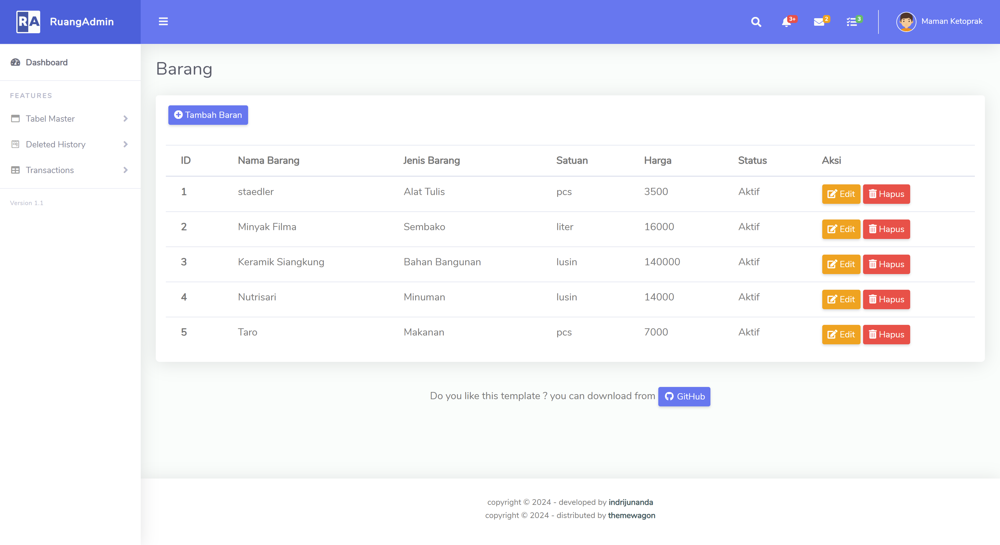

# Nama : Anisa Maharani
# NIM : 434221034
# Mata Kuliah : Pemrograman Basis Data
# Semester : 3

## Proyek UAS Membuat tampilan dari Desain Basis Data yang Diberikan

## Tools / Framework :
- Laravel
- MySql
- Laragon

## Ketentuan Umum : 
- Minimal terdapat 1 Function
- Minimal terdapat 1 Stored Procedure
- Minimal terdapat 1 View
- Minimal terdapat 1 Trigger

## Hasil
Penerapan Ketentuan : 
- 2 Fuction (Hitung biaya PPN, Hitung Grand Total Pengadaan)
- 3 Stored Procedure (Retur -- Detail Retur, Penerimaan -- Detail Penerimaan, Pengadaan -- Detail Pengadaan )
- 1 View (Stok Barang)
- 2 Trigger (Kartu Stok -- Retur, Kartu Stok -- Penerimaan)

Fitur tersedia : 
** Master **
- Login (Admin dan Kasir) & Logout
- Tambah Barang / Produk
- Tambah Satuan Barang  
- Tambah Jenis Barang
- Tambah Vendor
- Tambah Badan Hukum

** Transaksi **
- Tambah Pengadaan
- Tambah Penerimaan 
- Retur
- Penjualan
- Stok

 
 
 
 
 
